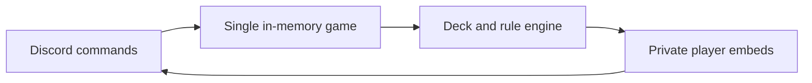

# Massacre Card Game Discord Bot

<p align="center">
  <a href="https://github.com/KeyErrorFinn/massacre-card-game-discord-bot/commits/main"></a>
  <a href="https://github.com/KeyErrorFinn/massacre-card-game-discord-bot/issues"></a>
</p>

<p align="center">
  
  
  
</p>

A Discord bot that runs a two-player implementation of the card game Massacre through commands and private-message embeds.

## Requirements

- Python 3
- `discord.py==1.7.3`
- `python-dotenv==0.21.1`
- A Discord bot application and token

This code targets the legacy discord.py 1.7 API and may require migration for current Discord behaviour.

## Setup

```bash
python -m pip install -r requirements.txt
```

Copy `.env.example` to `.env`:

```dotenv
DISCORD_TOKEN=your_bot_token
DISCORD_STREAMING_URL=https://example.com
DISCORD_OWNER_ID=your_numeric_discord_user_id
```

`DISCORD_TOKEN` and a numeric `DISCORD_OWNER_ID` are required. The streaming URL is used for the bot's activity. Never commit the populated file.

Invite the bot to a test server with the required message permissions, then run:

```bash
python massacre_game_discord_bot.py
```

## How games work

The bot maintains one shared game in memory. It constructs a standard deck plus two jokers, deals hidden, shown, and hand cards, determines the first turn, validates moves, handles pickups and pile burns, and sends each player a private embed view. Both players can ready up for the initial game and rematches.

State is lost when the process exits, and the implementation does not isolate independent games by server or channel.

## Command reference

The prefix is `!`; commands and aliases are case-insensitive.

| Command | Aliases | Purpose |
| --- | --- | --- |
| `!game` | `!g` | Create, invite, accept, and manage a game |
| `!MPlace <card>` | `!mp`, `!place` | Place a card during gameplay |
| `!MPickUp` | `!mpu`, `!pickup` | Pick up the pile |
| `!MSwap <hand-card> <shown-card>` | `!ms`, `!swap` | Swap cards during intermission |
| `!MReady` | `!mr`, `!ready` | Mark yourself ready |
| `!MCancel` | `!mc`, `!cancel` | Cancel the current game/rematch |
| `!MLeave` | `!leave` | Leave the game |
| `!MHelp` | `!mh`, `!help` | Show bot help |
| `!Ping` | None | Check whether the bot is responsive |

Card arguments use suit/value codes shown by the bot, such as `C5` or `S2`. The bot provides contextual usage errors when an argument is missing or invalid.

## Main source structure

`massacre_game_discord_bot.py` contains the Discord configuration, in-memory state, deck creation, dealing and sorting, embed rendering, game loop, rule validation, and command handlers.

<!-- documentation-extras -->

## Project flow



<details>
<summary>Documentation and maintenance notes</summary>

- Commands and behaviour in this README are derived from the files currently committed to the repository.
- External services, games, websites, browser APIs, and file formats can change independently of this project.
- When reporting a problem, include the operating system, runtime version, exact command, and complete error text with secrets removed.

</details>

## Contributing

Focused fixes are welcome. Before changing behaviour, open an issue describing the problem and intended result. Keep credentials, generated secrets, personal data, and machine-specific configuration out of commits. Update this README whenever commands, configuration, paths, or supported behaviour change.

## Licence

No project-level licence is currently declared in this repository. Copyright remains with the repository owner and other contributors; obtain permission before redistributing or incorporating the code elsewhere. Third-party assets and dependencies retain their own licences.
